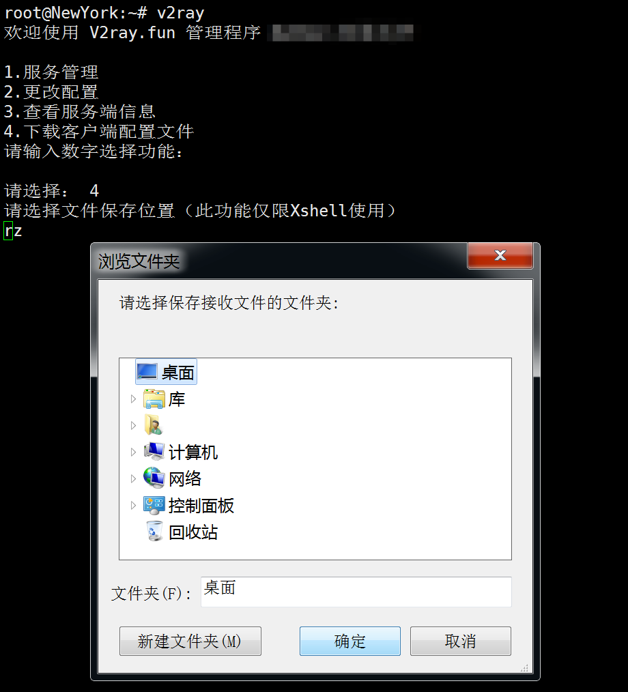

<h1 align="center">V2ray.fun</h1>

[![Telegram Group][tgbadge]][tggroup]
[![License][licensebadge]][licenselink]
[![PRs Welcome][prbadge]][prlink]
![Made With Love][lovebadge]

> 术业有专攻，一部分人一辈子都不会搞懂这些网络，但是他们仍然有权利自由地访问互联网，懂技术的人不一定可以通过技术改变世界。

V2ray 控制脚本，向导式更改端口，加密方式，传输协议，享受 V2ray 的乐趣~

## 功能

- 一键 启动 / 停止 / 重启 V2ray 服务端
- 自动随机生成 UUID
- 自助修改端口
- 快速查看服务器连接信息
- 一键下载客户端配置文件和二维码
- 自由更改传输配置：
  - 常规 TCP
  - HTTP 头部伪装
  - WebSocket 流量
  - 常规 mKCP 流量
  - mKCP 伪装 FaceTime 通话流量
  - mKCP 伪装 BT 下载流量
  - mKCP 伪装 微信视频通话流量

**WebSocket 不包括 Nginx 分流，请自行安装 Nginx 来分流。**

## 安装命令

```bash
bash -c "$(curl -fsSL https://git.io/fhQ99)"
```

## 升级命令
```bash
bash -c "$(curl -fsSL https://git.io/fhQ9Q)"
```

## 卸载命令
```bash
bash -c "$(curl -fsSL https://git.io/fhQ97)"
```


## 截图




## 系统要求

- Debian 7 
- Debian 8
- Ubuntu 14 
- Ubuntu 16 
- CentOS 7

## 致谢

上游原作者[雨落无声](https://github.com/YLWS-4617)

本 Fork 的作者与贡献者

每一位用户

[tgbadge]: https://img.shields.io/badge/Telegram-Group-3faee8.svg?style=for-the-badge&logo=data:image/svg+xml;base64,PD94bWwgdmVyc2lvbj0iMS4wIiBlbmNvZGluZz0iVVRGLTgiPz48IURPQ1RZUEUgc3ZnIFBVQkxJQyAiLS8vVzNDLy9EVEQgU1ZHIDEuMS8vRU4iICJodHRwOi8vd3d3LnczLm9yZy9HcmFwaGljcy9TVkcvMS4xL0RURC9zdmcxMS5kdGQiPjxzdmcgeG1sbnM9Imh0dHA6Ly93d3cudzMub3JnLzIwMDAvc3ZnIiB4bWxuczp4bGluaz0iaHR0cDovL3d3dy53My5vcmcvMTk5OS94bGluayIgdmVyc2lvbj0iMS4xIiB3aWR0aD0iMjQiIGhlaWdodD0iMjQiIHZpZXdCb3g9IjAgMCAyNCAyNCI+PHBhdGggZmlsbD0iI0ZGRkZGRiIgZD0iTTkuNzgsMTguNjVMMTAuMDYsMTQuNDJMMTcuNzQsNy41QzE4LjA4LDcuMTkgMTcuNjcsNy4wNCAxNy4yMiw3LjMxTDcuNzQsMTMuM0wzLjY0LDEyQzIuNzYsMTEuNzUgMi43NSwxMS4xNCAzLjg0LDEwLjdMMTkuODEsNC41NEMyMC41NCw0LjIxIDIxLjI0LDQuNzIgMjAuOTYsNS44NEwxOC4yNCwxOC42NUMxOC4wNSwxOS41NiAxNy41LDE5Ljc4IDE2Ljc0LDE5LjM2TDEyLjYsMTYuM0wxMC42MSwxOC4yM0MxMC4zOCwxOC40NiAxMC4xOSwxOC42NSA5Ljc4LDE4LjY1WiIgLz48L3N2Zz4=
[tggroup]: https://t.me/V2ray_Fun
[licensebadge]: https://img.shields.io/github/license/v2ray-fun/v2ray.fun.svg?style=for-the-badge&logo=gnu&logoColor=white
[licenselink]: https://github.com/tracyone/v2ray.fun/blob/master/LICENSE
[prlink]: https://github.com/v2ray-fun/v2ray.fun/pulls
[prbadge]: https://img.shields.io/badge/PRs-Welcome-28a745.svg?style=for-the-badge&logo=data:image/svg+xml;base64,PD94bWwgdmVyc2lvbj0iMS4wIiBlbmNvZGluZz0iVVRGLTgiPz48IURPQ1RZUEUgc3ZnIFBVQkxJQyAiLS8vVzNDLy9EVEQgU1ZHIDEuMS8vRU4iICJodHRwOi8vd3d3LnczLm9yZy9HcmFwaGljcy9TVkcvMS4xL0RURC9zdmcxMS5kdGQiPjxzdmcgeG1sbnM9Imh0dHA6Ly93d3cudzMub3JnLzIwMDAvc3ZnIiB4bWxuczp4bGluaz0iaHR0cDovL3d3dy53My5vcmcvMTk5OS94bGluayIgdmVyc2lvbj0iMS4xIiB3aWR0aD0iMjQiIGhlaWdodD0iMjQiIHZpZXdCb3g9IjAgMCAyNCAyNCI+PHBhdGggZmlsbD0iI0ZGRkZGRiIgZD0iTTYsM0EzLDMgMCAwLDEgOSw2QzksNy4zMSA4LjE3LDguNDIgNyw4LjgzVjE1LjE3QzguMTcsMTUuNTggOSwxNi42OSA5LDE4QTMsMyAwIDAsMSA2LDIxQTMsMyAwIDAsMSAzLDE4QzMsMTYuNjkgMy44MywxNS41OCA1LDE1LjE3VjguODNDMy44Myw4LjQyIDMsNy4zMSAzLDZBMywzIDAgMCwxIDYsM002LDVBMSwxIDAgMCwwIDUsNkExLDEgMCAwLDAgNiw3QTEsMSAwIDAsMCA3LDZBMSwxIDAgMCwwIDYsNU02LDE3QTEsMSAwIDAsMCA1LDE4QTEsMSAwIDAsMCA2LDE5QTEsMSAwIDAsMCA3LDE4QTEsMSAwIDAsMCA2LDE3TTIxLDE4QTMsMyAwIDAsMSAxOCwyMUEzLDMgMCAwLDEgMTUsMThDMTUsMTYuNjkgMTUuODMsMTUuNTggMTcsMTUuMTdWN0gxNVYxMC4yNUwxMC43NSw2TDE1LDEuNzVWNUgxN0EyLDIgMCAwLDEgMTksN1YxNS4xN0MyMC4xNywxNS41OCAyMSwxNi42OSAyMSwxOE0xOCwxN0ExLDEgMCAwLDAgMTcsMThBMSwxIDAgMCwwIDE4LDE5QTEsMSAwIDAsMCAxOSwxOEExLDEgMCAwLDAgMTgsMTdaIiAvPjwvc3ZnPg==
[lovebadge]: https://img.shields.io/badge/Made_with-Love-red.svg?style=for-the-badge&logo=data:image/svg+xml;base64,PD94bWwgdmVyc2lvbj0iMS4wIiBlbmNvZGluZz0iVVRGLTgiPz48IURPQ1RZUEUgc3ZnIFBVQkxJQyAiLS8vVzNDLy9EVEQgU1ZHIDEuMS8vRU4iICJodHRwOi8vd3d3LnczLm9yZy9HcmFwaGljcy9TVkcvMS4xL0RURC9zdmcxMS5kdGQiPjxzdmcgeG1sbnM9Imh0dHA6Ly93d3cudzMub3JnLzIwMDAvc3ZnIiB4bWxuczp4bGluaz0iaHR0cDovL3d3dy53My5vcmcvMTk5OS94bGluayIgdmVyc2lvbj0iMS4xIiB3aWR0aD0iMjQiIGhlaWdodD0iMjQiIHZpZXdCb3g9IjAgMCAyNCAyNCI+PHBhdGggZmlsbD0iI0ZGRkZGRiIgZD0iTTEyLDIxLjM1TDEwLjU1LDIwLjAzQzUuNCwxNS4zNiAyLDEyLjI3IDIsOC41QzIsNS40MSA0LjQyLDMgNy41LDNDOS4yNCwzIDEwLjkxLDMuODEgMTIsNS4wOEMxMy4wOSwzLjgxIDE0Ljc2LDMgMTYuNSwzQzE5LjU4LDMgMjIsNS40MSAyMiw4LjVDMjIsMTIuMjcgMTguNiwxNS4zNiAxMy40NSwyMC4wM0wxMiwyMS4zNVoiIC8+PC9zdmc+
